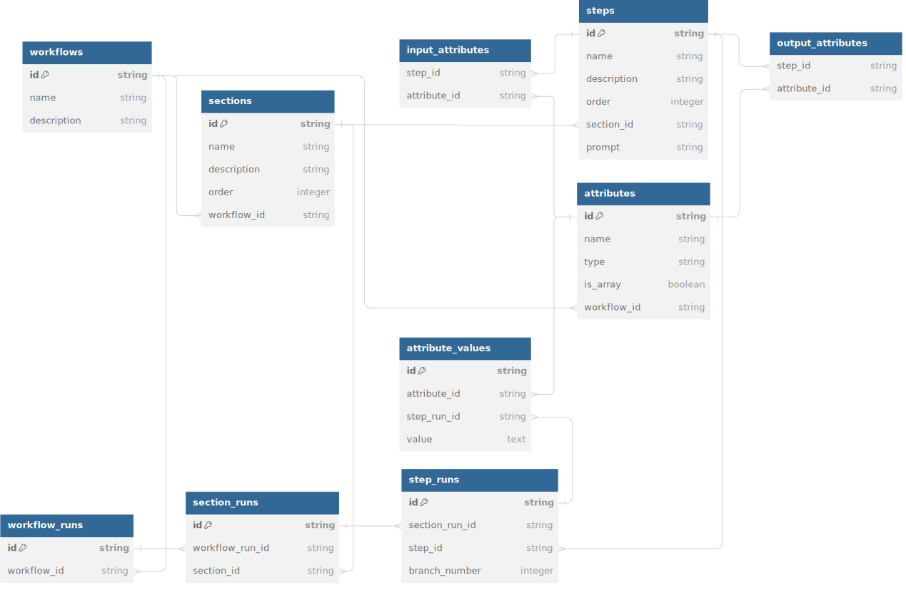
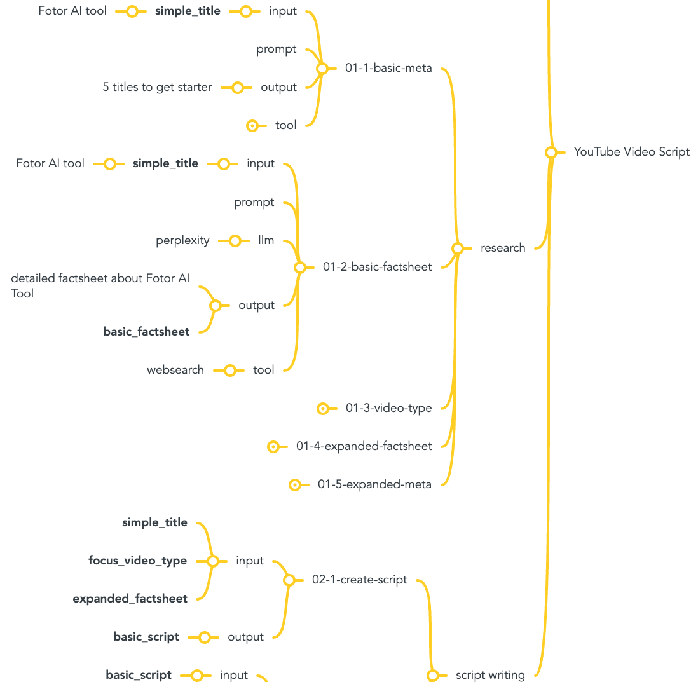

## Schema for AI Agents

### Entity Relationship Diagram



### Static Workflow Definition

Static workflow definition defines the structure of a workflow, including its sections, steps, attributes, and their relationships.



### Static Workflow Entities

#### Table: workflows

This table stores the basic information about each workflow, including its unique identifier, name, and description.

| Field       | Type   | Description                         |
|-------------|--------|-------------------------------------|
| id          | string | Unique identifier for the workflow  |
| name        | string | The name of the workflow            |
| description | string | A brief description of the workflow |

#### Table: sections
This table stores the sections that belong to a workflow. Each section has an order within its workflow.

| Field       | Type    | Description                            |
|-------------|---------|----------------------------------------|
| id          | string  | Unique identifier for the section      |
| workflow_id | string  | Foreign key referencing workflows      |
| name        | string  | The name of the section                |
| description | string  | A brief description of the section     |
| order       | integer | The order of the section in the workflow|

#### Table: steps

This table stores the steps that belong to a section. Each step has an order within its section and an associated prompt.

Example workflows include "YouTube Video Script", "YouTube Title Creator" and "YouTube Transcription to Medium Article".

| Field       | Type    | Description                         |
|-------------|---------|-------------------------------------|
| id          | string  | Unique identifier for the step      |
| section_id  | string  | Foreign key referencing sections    |
| name        | string  | The name of the step                |
| action      | string  | The action to be performed by the step, default ('gpt') |
| description | string  | A brief description of the step     |
| order       | integer | The order of the step in the section|
| prompt      | string  | The template string for the prompt  |

#### Table: attributes

This table stores the attributes associated with a workflow. Each attribute can be a simple value or an array.

Example attributes include "simple_title", "basic_factsheet" and "working_title".

| Field       | Type    | Description                                 |
|-------------|---------|---------------------------------------------|
| id          | string  | Unique identifier for the attribute         |
| workflow_id | string  | Foreign key referencing workflows           |
| name        | string  | The name of the attribute                   |
| type        | string  | The type of the attribute (e.g., string)    |
| is_array    | boolean | Indicates whether the attribute is an array |

#### Table: input_attributes

This table maps input attributes to steps. This becomes the input parameters for the AI agent.

| Field       | Type    | Description                        |
|-------------|---------|------------------------------------|
| step_id     | string  | Foreign key referencing steps      |
| attribute_id| string  | Foreign key referencing attributes |
| required    | boolean | Indicates whether the attribute is required |

#### Table: output_attributes

This table maps output attributes to steps. This becomes a result of the AI agent.

| Field       | Type    | Description                        |
|-------------|---------|------------------------------------|
| step_id     | string  | Foreign key referencing steps      |
| attribute_id| string  | Foreign key referencing attributes |

### Dynamic Workflow Execution

Dynamic workflow execution captures the actual execution of a workflow, including the workflow runs, section runs, step runs, and attribute values.

### Dynamic Workflow Entities

#### Table: workflow_runs

This table stores instances of workflow executions.

| Field       | Type   | Description                           |
|-------------|--------|---------------------------------------|
| id          | string | Unique identifier for the workflow run|
| workflow_id | string | Foreign key referencing workflows     |

#### Table: section_runs
This table stores instances of section executions within a workflow run.

| Field           | Type   | Description                            |
|-----------------|--------|----------------------------------------|
| id              | string | Unique identifier for the section run  |
| section_id      | string | Foreign key referencing sections       |
| workflow_run_id | string | Foreign key referencing workflow_runs  |

#### Table: step_runs
This table stores instances of step executions within a section run. Each step run can have multiple branches.

| Field            | Type    | Description                                                         |
|------------------|---------|---------------------------------------------------------------------|
| id               | string  | Unique identifier for the step run                                  |
| section_run_id   | string  | Foreign key referencing section_runs                                |
| step_id          | string  | Foreign key referencing steps                                       |
| branch_number    | integer | Branch number to distinguish different instances (branches) of the same step |

#### Table: attribute_values
This table stores the values of attributes during step executions.

| Field         | Type   | Description                             |
|---------------|--------|-----------------------------------------|
| id            | string | Unique identifier for the attribute value|
| attribute_id  | string | Foreign key referencing attributes      |
| step_run_id   | string | Foreign key referencing step_runs       |
| value         | text   | The actual value of the attribute during the step execution |

## Gemfile

```ruby

# Gemfile

source 'https://rubygems.org'

gem 'sequel'
gem 'sqlite3'
```

## Database Setup


```ruby
# db_setup.rb

require 'sequel'

DB = Sequel.sqlite('workflow.db') # Creates an SQLite database called workflow.db

# Create the tables for static workflow definition
DB.create_table :workflows do
  primary_key :id
  String :name, null: false
  String :description
end

DB.create_table :sections do
  primary_key :id
  String :name, null: false
  String :description
  Integer :order
  foreign_key :workflow_id, :workflows
end

DB.create_table :steps do
  primary_key :id
  String :name, null: false
  String :description
  Integer :order
  foreign_key :section_id, :sections
  String :prompt
end

DB.create_table :attributes do
  primary_key :id
  String :name, null: false
  String :type
  Boolean :is_array
  foreign_key :workflow_id, :workflows
end

DB.create_table :input_attributes do
  foreign_key :step_id, :steps
  foreign_key :attribute_id, :attributes
end

DB.create_table :output_attributes do
  foreign_key :step_id, :steps
  foreign_key :attribute_id, :attributes
end

# Create the tables for dynamic workflow execution
DB.create_table :workflow_runs do
  primary_key :id
  foreign_key :workflow_id, :workflows
end

DB.create_table :section_runs do
  primary_key :id
  foreign_key :workflow_run_id, :workflow_runs
  foreign_key :section_id, :sections
end

DB.create_table :step_runs do
  primary_key :id
  foreign_key :section_run_id, :section_runs
  foreign_key :step_id, :steps
  Integer :branch_number
end

DB.create_table :attribute_values do
  primary_key :id
  foreign_key :attribute_id, :attributes
  foreign_key :step_run_id, :step_runs
  String :value
end
```

## Models

```ruby
# models.rb

require 'sequel'

DB = Sequel.sqlite('workflow.db') # Connect to the SQLite database

# Static Workflow Definition

class Workflow < Sequel::Model
  one_to_many :sections
  one_to_many :attributes
  one_to_many :workflow_runs
end

class Section < Sequel::Model
  many_to_one :workflow
  one_to_many :steps
  one_to_many :section_runs
end

class Step < Sequel::Model
  many_to_one :section
  one_to_many :input_attributes, class: :StepInputAttribute
  one_to_many :output_attributes, class: :StepOutputAttribute
  one_to_many :step_runs
end

class Attribute < Sequel::Model
  many_to_one :workflow
  one_to_many :input_attributes, class: :StepInputAttribute
  one_to_many :output_attributes, class: :StepOutputAttribute
end

class StepInputAttribute < Sequel::Model
  many_to_one :step
  many_to_one :attribute
end

class StepOutputAttribute < Sequel::Model
  many_to_one :step
  many_to_one :attribute
end

# Dynamic Workflow Execution

class WorkflowRun < Sequel::Model
  many_to_one :workflow
  one_to_many :section_runs
end

class SectionRun < Sequel::Model
  many_to_one :workflow_run
  many_to_one :section
  one_to_many :step_runs
end

class StepRun < Sequel::Model
  many_to_one :section_run
  many_to_one :step
  one_to_many :attribute_values
end

class AttributeValue < Sequel::Model
  many_to_one :attribute
  many_to_one :step_run
end

```

## Usage via Models

```ruby
# example_usage.rb

require_relative 'models'

# Create a new workflow
workflow = Workflow.create(name: "YouTube Video Script", description: "Workflow for creating a YouTube video script")

# Create sections for the workflow
section1 = Section.create(name: "Research", description: "Research phase", order: 1, workflow: workflow)
section2 = Section.create(name: "Script Writing", description: "Script writing phase", order: 2, workflow: workflow)

# Create steps for the sections
step1 = Step.create(name: "01-1-basic-meta", description: "Basic metadata for Fotor AI tool", order: 1, section: section1, prompt: "Generate 5 titles to get started")
step2 = Step.create(name: "01-2-basic-factsheet", description: "Detailed factsheet about Fotor AI Tool", order: 2, section: section1, prompt: "Generate detailed factsheet")

# Create attributes
attribute1 = Attribute.create(name: "simple_title", type: "string", is_array: false, workflow: workflow)
attribute2 = Attribute.create(name: "basic_factsheet", type: "string", is_array: false, workflow: workflow)

# Associate input and output attributes with steps
StepInputAttribute.create(step: step1, attribute: attribute1)
StepOutputAttribute.create(step: step1, attribute: attribute2)

# Create a workflow run
workflow_run = WorkflowRun.create(workflow: workflow)

# Create section runs
section_run1 = SectionRun.create(workflow_run: workflow_run, section: section1)
section_run2 = SectionRun.create(workflow_run: workflow_run, section: section2)

# Create step runs
step_run1 = StepRun.create(section_run: section_run1, step: step1, branch_number: 1)
step_run2 = StepRun.create(section_run: section_run1, step: step2, branch_number: 1)

# Add attribute values to step runs
AttributeValue.create(attribute: attribute1, step_run: step_run1, value: "Fotor AI tool")
AttributeValue.create(attribute: attribute2, step_run: step_run2, value: "Detailed factsheet about Fotor AI Tool")
```

## Exporting to JSON

```ruby
# export_to_json.rb

require 'json'
require_relative 'models'

# Export all workflows to JSON files
Workflow.all.each do |workflow|
  workflow_data = {
    id: workflow.id,
    name: workflow.name,
    description: workflow.description,
    sections: workflow.sections.map do |section|
      {
        id: section.id,
        name: section.name,
        description: section.description,
        order: section.order,
        steps: section.steps.map do |step|
          {
            id: step.id,
            name: step.name,
            description: step.description,
            order: step.order,
            prompt: step.prompt,
            input_attributes: step.input_attributes.map { |ia| { id: ia.attribute.id, name: ia.attribute.name } },
            output_attributes: step.output_attributes.map { |oa| { id: oa.attribute.id, name: oa.attribute.name } }
          }
        end
      }
    end,
    attributes: workflow.attributes.map { |attr| { id: attr.id, name: attr.name, type: attr.type, is_array: attr.is_array } }
  }

  File.write("workflow_#{workflow.id}.json", JSON.pretty_generate(workflow_data))
end

# Export all workflow runs to JSON files
WorkflowRun.all.each do |workflow_run|
  workflow_run_data = {
    id: workflow_run.id,
    workflow_id: workflow_run.workflow_id,
    section_runs: workflow_run.section_runs.map do |section_run|
      {
        id: section_run.id,
        section_id: section_run.section_id,
        step_runs: section_run.step_runs.map do |step_run|
          {
            id: step_run.id,
            step_id: step_run.step_id,
            branch_number: step_run.branch_number,
            attribute_values: step_run.attribute_values.map { |av| { id: av.attribute.id, name: av.attribute.name, value: av.value } }
          }
        end
      }
    end
  }

  File.write("workflow_run_#{workflow_run.id}.json", JSON.pretty_generate(workflow_run_data))
end
```

## Importing from JSON

```ruby
# import_from_json.rb

require 'json'
require_relative 'models'

# Helper function to find or create an attribute
def find_or_create_attribute(attr_data, workflow)
  Attribute.find_or_create(name: attr_data['name'], workflow: workflow) do |attribute|
    attribute.type = attr_data['type']
    attribute.is_array = attr_data['is_array']
  end
end

# Restore workflows from JSON files
Dir.glob('workflow_*.json').each do |file|
  data = JSON.parse(File.read(file))
  
  workflow = Workflow.find_or_create(id: data['id']) do |w|
    w.name = data['name']
    w.description = data['description']
  end

  data['sections'].each do |section_data|
    section = Section.find_or_create(id: section_data['id'], workflow: workflow) do |s|
      s.name = section_data['name']
      s.description = section_data['description']
      s.order = section_data['order']
    end

    section_data['steps'].each do |step_data|
      step = Step.find_or_create(id: step_data['id'], section: section) do |s|
        s.name = step_data['name']
        s.description = step_data['description']
        s.order = step_data['order']
        s.prompt = step_data['prompt']
      end

      step_data['input_attributes'].each do |attr_data|
        attribute = find_or_create_attribute(attr_data, workflow)
        StepInputAttribute.find_or_create(step: step, attribute: attribute)
      end

      step_data['output_attributes'].each do |attr_data|
        attribute = find_or_create_attribute(attr_data, workflow)
        StepOutputAttribute.find_or_create(step: step, attribute: attribute)
      end
    end
  end

  data['attributes'].each do |attr_data|
    find_or_create_attribute(attr_data, workflow)
  end
end

# Restore workflow runs from JSON files
Dir.glob('workflow_run_*.json').each do |file|
  data = JSON.parse(File.read(file))

  workflow_run = WorkflowRun.find_or_create(id: data['id'], workflow_id: data['workflow_id'])

  data['section_runs'].each do |section_run_data|
    section_run = SectionRun.find_or_create(id: section_run_data['id'], workflow_run: workflow_run, section_id: section_run_data['section_id'])

    section_run_data['step_runs'].each do |step_run_data|
      step_run = StepRun.find_or_create(id: step_run_data['id'], section_run: section_run, step_id: step_run_data['step_id'], branch_number: step_run_data['branch_number'])

      step_run_data['attribute_values'].each do |attr_value_data|
        attribute = Attribute.find(id: attr_value_data['id'])
        AttributeValue.find_or_create(attribute: attribute, step_run: step_run) do |av|
          av.value = attr_value_data['value']
        end
      end
    end
  end
end
```

## Sample Implementation of Workflow Builder (DSL)

```ruby
require 'yaml'
require 'sequel'

# Assuming the database and models are already set up
DB = Sequel.sqlite('workflow.db')

# Models
class Workflow < Sequel::Model
  one_to_many :sections
  one_to_many :attributes
  one_to_many :workflow_runs
end

class Section < Sequel::Model
  many_to_one :workflow
  one_to_many :steps
  one_to_many :section_runs
end

class Step < Sequel::Model
  many_to_one :section
  one_to_many :input_attributes, class: :StepInputAttribute
  one_to_many :output_attributes, class: :StepOutputAttribute
  one_to_many :step_runs
end

class Attribute < Sequel::Model
  many_to_one :workflow
  one_to_many :input_attributes, class: :StepInputAttribute
  one_to_many :output_attributes, class: :StepOutputAttribute
end

class StepInputAttribute < Sequel::Model
  many_to_one :step
  many_to_one :attribute
end

class StepOutputAttribute < Sequel::Model
  many_to_one :step
  many_to_one :attribute
end

# WorkflowBuilder
class WorkflowBuilder
  def initialize(name:, description: nil)
    @workflow = Workflow.new(name: name, description: description)
    @current_section_order = 1
  end

  def description(desc)
    @workflow.description = desc
  end

  def section(name:, &block)
    @current_step_order = 1
    @current_section = Section.new(name: name, order: @current_section_order)
    @current_section_order += 1
    instance_eval(&block) if block_given?
    @workflow.add_section(@current_section)
  end

  def step(name:, &block)
    step = Step.new(name: name, order: @current_step_order)
    @current_step_order += 1
    instance_eval(&block) if block_given?
    @current_section.add_step(step)
  end

  def prompt(prompt)
    @current_section.steps.last.prompt = prompt
  end

  def save
    @workflow.save
  end

  def to_yaml
    workflow_data = {
      id: @workflow.id,
      name: @workflow.name,
      description: @workflow.description,
      sections: @workflow.sections.map do |section|
        {
          id: section.id,
          name: section.name,
          description: section.description,
          order: section.order,
          steps: section.steps.map do |step|
            {
              id: step.id,
              name: step.name,
              description: step.description,
              order: step.order,
              prompt: step.prompt
            }
          end
        }
      end
    }
    workflow_data.to_yaml
  end
end

```

## Usage via DSL

```ruby
builder = WorkflowBuilder.new(name: 'YouTube Video Script')

builder.section(name: 'Research') do
  step(name: '01-1-basic-meta') do
    prompt 'Generate 5 titles to get started'
  end

  step(name: '01-2-basic-factsheet') do
    prompt 'Generate detailed factsheet'
  end
end

builder.section(name: 'Script Writing') do
  step(name: '02-1-create-script') do
    prompt 'Generate basic script'
  end
end

puts builder.to_yaml

# Save to the database
builder.save


builder = WorkflowBuilder.new(name: 'YouTube Title Creator')

builder.section(name: 'Research') do
  step(name: '01-1-working-title') do
    prompt 'Come up with a simple working title for the YouTube video.'
  end

  step(name: '01-2-keyword-research') do
    prompt 'Perform basic keyword research to identify relevant keywords.'
  end

  step(name: '01-3-topic-research') do
    prompt 'Conduct basic topic research to gather information on the subject.'
  end

  step(name: '01-4-powerful-titles') do
    prompt 'Ask GPT for 10 powerful titles based on the research.'
  end

  step(name: '01-5-title-rules') do
    prompt 'Follow specific rules for title creation to ensure effectiveness.'
  end
end

puts builder.to_yaml

# Save to the database
builder.save

```